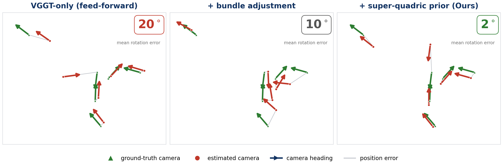
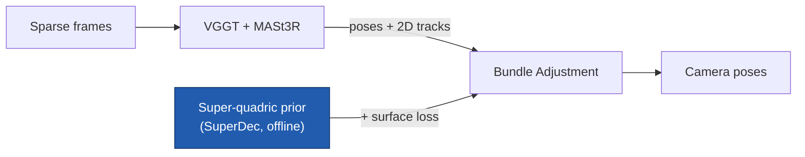
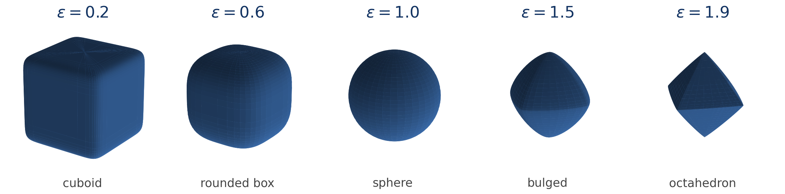
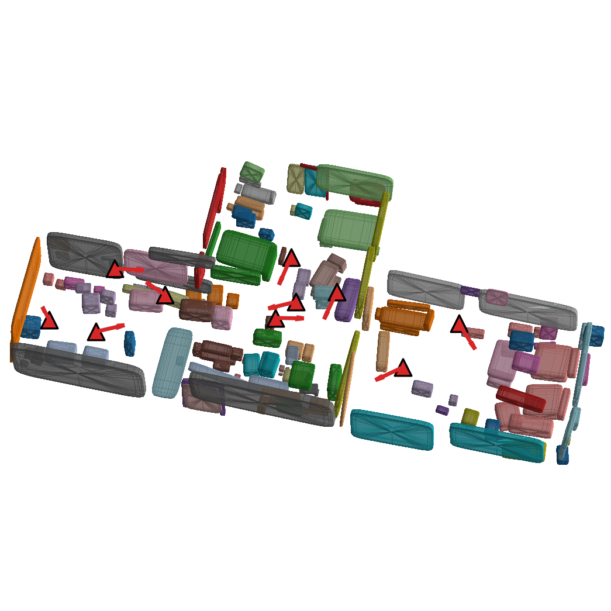

# Improving Relocalization Accuracy via an Environment Prior

A super-quadric model of a known scene, added as an extra term inside bundle
adjustment, improves camera-pose accuracy. The gain is largest when the input
views are sparse and barely overlap.

3D Vision course project (252-0579-00L, Spring 2026), Computer Vision and
Geometry Group, ETH Zurich.

<p align="center">
  <br>
  <sub>Estimated cameras (red) move toward ground truth (green) as bundle adjustment, then the super-quadric prior, are added. One scene, 6 views; mean rotation error 20° to 10° to 2°.</sub>
</p>

---

## Overview

Relocalization (the "kidnapped robot" problem) asks for an accurate camera pose
inside a *known* environment. Feed-forward transformer SfM such as VGGT gives
fast initial poses but cannot exploit a prior, and it degrades when views are
few and have little overlap. We refine those poses with classic bundle
adjustment (BA) and add one extra cost term: a one-sided surface loss that pulls
each triangulated 3D point toward the super-quadric primitives that SuperDec has
already fit to the scene.

## Result

Pose AUC@5 (higher is better), averaged over 10 Aria Synthetic Environments
scenes. "Baseline" is bundle adjustment with the surface term off; "Ours" is the
same BA with the super-quadric prior on.

| Input views | VGGT-only | Baseline (BA) | Ours (BA + prior) | Gain from prior |
|:-----------:|:---------:|:-------------:|:-----------------:|:---------------:|
| 4           | 27.7      | 39.3          | 40.7              | +1.3            |
| 6           | 20.4      | 29.6          | 31.1              | +1.5            |
| 8           | 13.4      | 27.9          | 28.0              | +0.1            |
| 10          | 9.3       | 29.4          | 29.6              | +0.2            |

- Bundle adjustment does the bulk of the work.
- The super-quadric prior is credited only with its marginal gain over the BA
  baseline. That gain is large at 4 to 6 views but negligible once 8 to 10 views
  already constrain the geometry.
- With per-view tuning of the prior weight the 4-view gain reaches +2.0.
- At 6 views the prior helps 3 of the 10 scenes (up to +9.3) and hurts none.

Dense views already pin the cameras through reprojection, so the prior adds
little; sparse views do not, and the surface term supplies the missing
constraint.

## How it works



1. **Feed-forward poses and depth.** VGGT (run through the MapAnything wrapper)
   produces an initial pose and depth for every input view.
2. **Correspondences.** MASt3R matches every pair of views and yields dense
   reciprocal 2D correspondences.
3. **Triangulation.** Each matched pixel pair is triangulated to a world-frame
   3D point by the midpoint method, with cheirality and in-bounds filtering.
4. **Bundle adjustment.** A Ceres problem refines cameras and points under a
   Huber reprojection loss.
5. **Super-quadric prior.** SuperDec fits a compact set of super-quadrics to the
   scene point cloud offline. During BA, each triangulated point is associated
   to its nearest primitive and a one-sided point-to-surface (hinge) residual
   pulls it onto that surface. An EM-style step re-associates the moving points
   to their nearest primitive every few iterations, after a short
   reprojection-only warm-up.

<p align="center">
  <br>
  <sub>One super-quadric swept through its roundness exponent: a single family covers cuboids, spheres, and octahedra. A handful of them tile a room.</sub>
</p>

<p align="center">
  <br>
  <sub>A scene decomposed into super-quadrics (floor hidden), with the camera poses (red) we solve for.</sub>
</p>

The full objective is the reprojection term plus the weighted one-sided surface
term:

$$
E = \underbrace{\sum_{i,j}\rho\!\left(\lVert \pi(R_i,t_i,X_j)-x_{ij}\rVert^2\right)}_{\text{reprojection}}
\;+\; \underbrace{\sum_{j}\left(\lambda\,\lVert q_j\rVert\,\max\!\left(0,\,1-F(q_j)^{-\varepsilon_1/2}\right)\right)^2}_{\text{surface prior}}
$$

where $F$ is the inside-outside function of the super-quadric nearest to point
$X_j$ and $\lambda$ is the prior weight.

## Repository layout

This is a single git repository. The code we wrote lives in two packages:

| Path        | What it is |
|-------------|------------|
| `ba/`       | Ceres-based bundle adjustment. C++ backends in `ba/src/`, Python bindings and helpers in `ba/python/ba/`, benchmark, analysis, and figure scripts in `ba/eval/`. |
| `compose/`  | Data pipelines and SuperDec orchestration: ASE download, WAI conversion, point-cloud extraction, super-quadric fitting, covisibility analysis, and visualization. See `compose/CLAUDE.md`. |
| `poster/`   | The A1 poster (LaTeX beamerposter) and its figures. |

Three upstream frameworks are vendored in-tree and used as-is. They are
gitignored, so they are not part of this repository's history; install them
separately (see their own documentation).

| Path            | Role |
|-----------------|------|
| `map-anything/` | Multi-view reconstruction backbone, hosts the VGGT wrapper used by the benchmark. |
| `mast3r/`       | Pairwise feature matcher used to build correspondences. |
| `superdec/`     | Super-quadric scene decomposition (SuperDec, ICCV 2025). |

The three C++ BA backends:

- `mast3r_ba_core` reprojection-only BA.
- `mast3r_sq_ba_core` reprojection BA plus the super-quadric surface residual (the one used for all results above).
- `vggt_sq_ba_core` work in progress, not yet wired up.

## Setup

The code was developed for the ETH D-INFK student cluster and assumes the team
folder is at `/work/courses/3dv/team39`. Several scripts use that path directly.
See `CLUSTER.md` for the full environment reference (Slurm account, storage,
CUDA, and PyTorch versions).

The shared environment uses CUDA 13.0.2 and PyTorch 2.10.0+cu130 in a virtual
environment at `envs/3dv`.

### Build the C++ extensions

The bundle adjustment backends are compiled with CMake against Ceres, Eigen,
glog, gflags, and SuiteSparse:

```bash
cd ba/build
cmake ..
make -j$(nproc)
```

This produces the `*_core` shared objects next to the `ba` Python package. To
make the package importable as `ba`:

```bash
pip install -e ba/python
```

If a backend is missing at import, `ba` raises a `ModuleNotFoundError` naming the
missing `*_core` module and the build command above.

## Reproduce

### 1. Build the dataset and super-quadric models

The `compose` package downloads Aria Synthetic Environments scenes, converts
them to the shared WAI format, extracts per-object point clouds, and runs
SuperDec to produce one `.npz` of super-quadrics per scene:

```bash
cd compose
# end-to-end on the cluster (WAI conversion -> point clouds -> SuperDec -> GLB)
sbatch slurm/run_all.sh
```

See `compose/CLAUDE.md` for the step-by-step commands and the expected data
layout under `compose/data/`.

### 2. Run the benchmark

The sparse-view benchmark runs VGGT, builds MASt3R correspondences, triangulates,
and solves the surface-augmented BA with EM re-association (the settings used for
the results above). The view count is configurable (4, 6, 8, 10):

```bash
# from the repo root, on a GPU node
NUM_VIEWS=6 LAMBDA_SURFACE=15.0 sbatch compose/slurm/run_sparse_surface_em_benchmark.sh
```

Set `LAMBDA_SURFACE=0` to get the BA baseline (surface term off) for the same
views. Results are written under `logs/benchmark_ase_sparse_surface_em_cov06_*`.

### 3. Regenerate the figures

The poster figures are produced by standalone scripts in `ba/eval/` (run with
the shared venv from `ba/eval/`):

| Figure                              | Script |
|-------------------------------------|--------|
| Super-quadric shape family          | `fig_superquadric_family.py` |
| Clean 3D scene (primitives + cameras) | `fig_sq3d_clean.py` |
| Per-stage pose comparison (scene 6) | `fig_poses_v6_s6.py` |

## The poster

`poster/poster.tex` is the A1 portrait poster, built with `pdflatex` (two
passes). Layout knobs and the figure list are documented in `poster/README.md`.

## References

1. Wang et al. *VGGT: Visual Geometry Grounded Transformer.* CVPR 2025.
2. Keetha et al. *MapAnything: Universal Feed-Forward Metric 3D Reconstruction.* 3DV 2026.
3. Leroy et al. *Grounding Image Matching in 3D with MASt3R.* ECCV 2024.
4. Fedele et al. *SuperDec: 3D Scene Decomposition with Superquadric Primitives.* ICCV 2025.
5. Mueller et al. *Reconstructing People, Places, and Cameras.* CVPR 2025.

## Authors

David Farah, Lars Hecker, Raman Besenfelder, Fatemeh Sadat Daneshmand,
Elisabetta Fedele, Linfei Pan.

Computer Vision and Geometry Group, ETH Zurich (Fatemeh Sadat Daneshmand: ZHAW).
